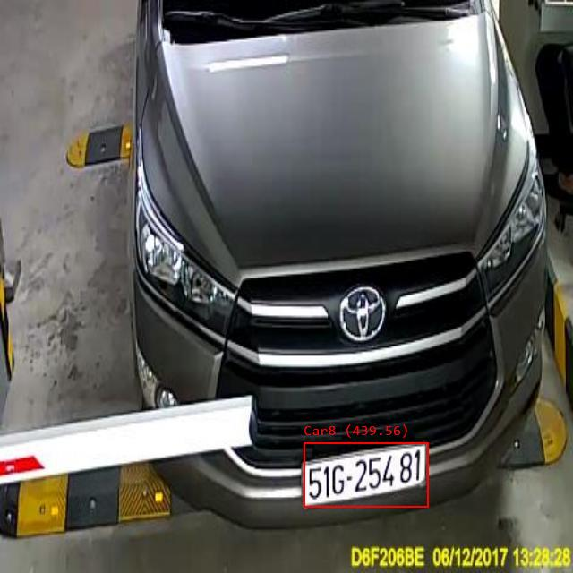

### C#-ML.Met基于Yolov5模型的车牌区域识别工程
---

## 工程目标
使C#开发人员可以应用别人的yolov5模型，这里以车牌分割为例

## yolov5-net
[代码Fork自https://github.com/mentalstack/yolov5-net](https://github.com/mentalstack/yolov5-net)

## 相关修改
- plate_detect.onnx下载自https://github.com/we0091234/Chinese_license_plate_detection_recognition
- 修改Label List，取决于分类个数
- 修改Model-Demisions，Class数+5
- NamedOnnxValue.CreateFromTensor("input", ExtractPixels(resized ?? image))
这里的input换成Model输入名

## 分割效果

## TBD
对分割的车牌区域进行OCR识别

